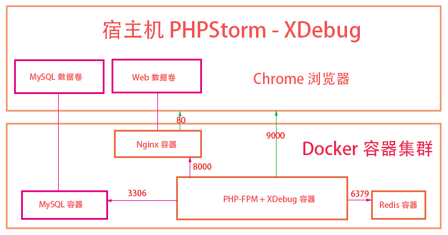
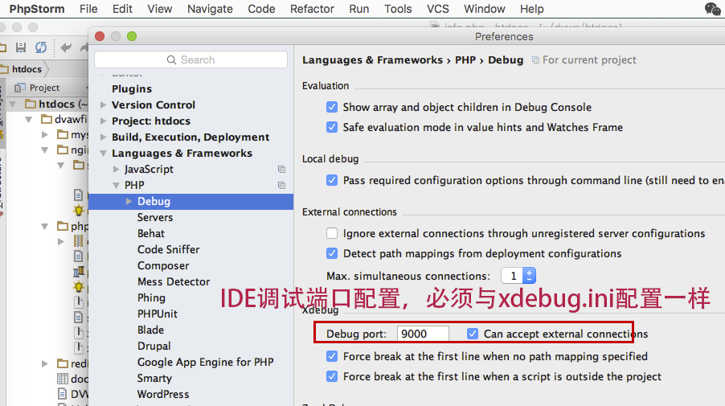
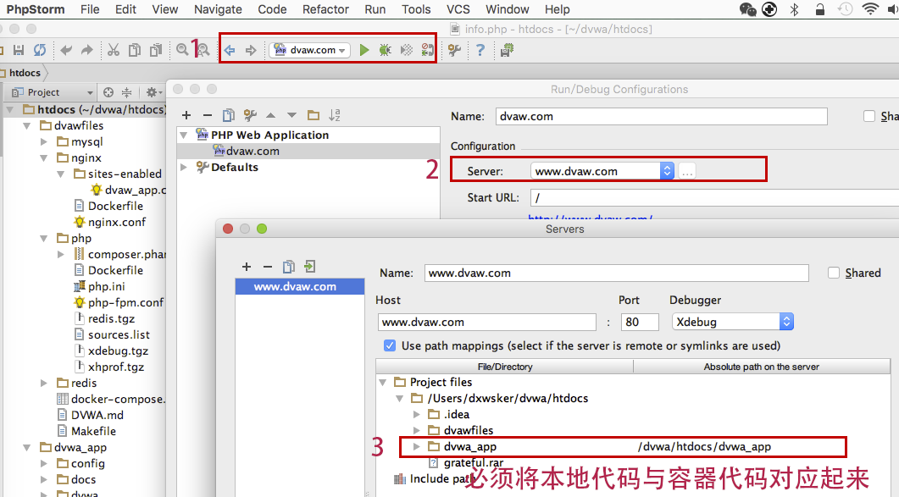

Docker容器化PHP开发环境搭建-DVWA (含xdebug调试)
=

Docker容器化技术在过去的2015年得到了大面积的普及应用，特别是以灵雀云、数人云、阿里云以及阿里百川TAE2.0等为代表的服务商的推动，可以预见2016会是云服务大爆发的一年，会有越来越多的互联网企业将自己的业务部署到基于Docker容器的环境里来。

本文以[DVWA](https://github.com/MarkThink/DVWA)部署为例，来讲解PHP环境部署+基于XDEBUG调试环境的容器化解决方案。

[segmentfault参考链接](http://segmentfault.com/a/1190000002528341)




##创建目录

###基础目录

- ~/dvwa/data  		存放MySQL数据库
- ~/dvwa/htdocs 	项目代码
- ~/dvwa/log		存放所有输出log

###从代码仓库构建

```
cd ~
git clone https://github.com/MarkThink/DockerPHP.git dvwa
```

##创建这些目录

```
mkdir ~/dvwa ~/dvwa/data ~/dvwa/data/mysql ~/dvwa/log ~/dvwa/log/nginx ~/dvwa/log/php ~/dvwa/htdocs
```

##下载镜像及构建

```
cd ~/dvwa/htdocs/dvawfiles
make pull
make dl
make build
```

##下载代码

```
cd ~/dvwa/htdocs
git clone https://github.com/MarkThink/DVWA.git dvwa_app
```


##IDE调试配置






##绑定域名

```
sudo vi /etc/hosts

192.168.99.100	www.dvwa.com
```

https://www.arroyolabs.com/2016/10/docker-xdebug/

# docker-xdebug
Example of how to integrate Docker with xdebug on clean Erdiko example

## Quick Start

With current settings you will need to create an alias with static IP
on Linux:

`sudo ip addr add 10.254.254.254/24 brd + dev eth0 label eth0:1`

if you're running OS X:

`sudo ifconfig en0 alias 10.254.254.254 255.255.255.0`


Go to `xdebug_56/docker` and run `docker-compose up`, and voila, a pristine
Erdiko project up and running.

To browse it go to http://localhost:8088/

> for xdebug Client setup & alternate configuration please refer to: 
>
> http://blog.arroyolabs.com/2016/10/docker-xdebug/

###Happly Enjoy!


